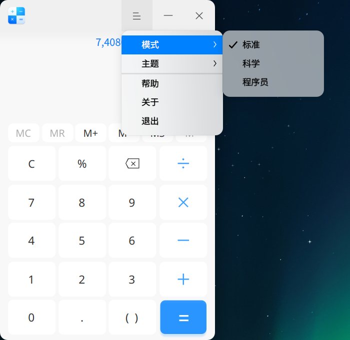
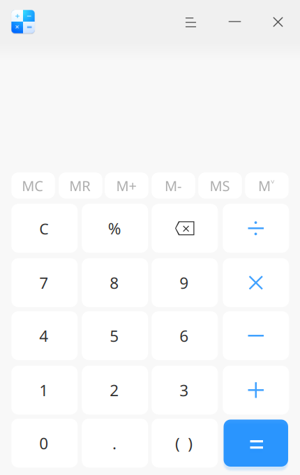
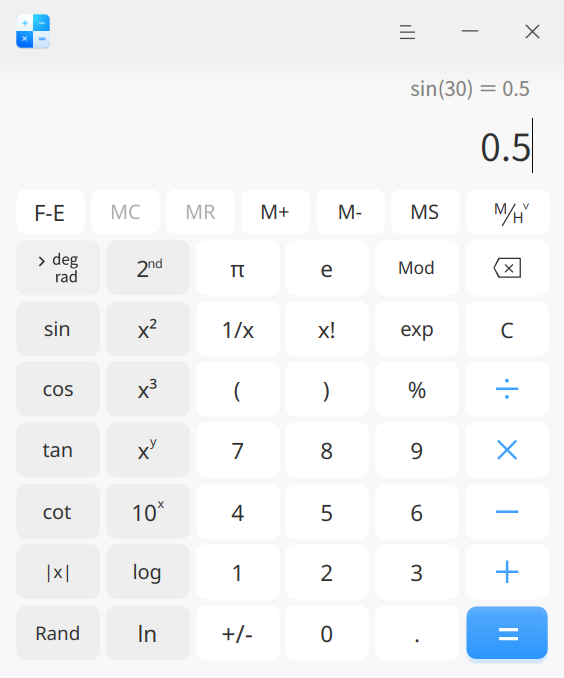
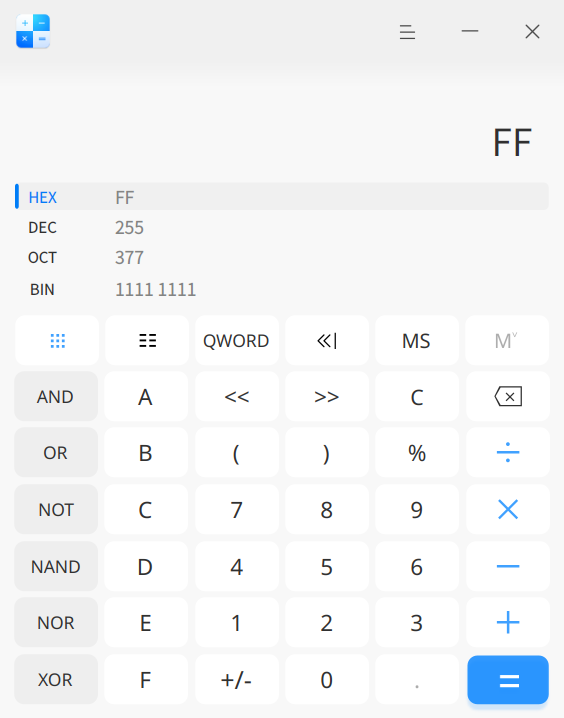
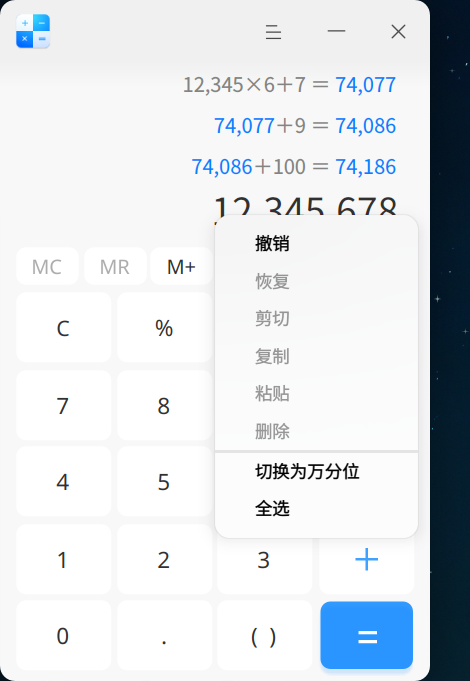
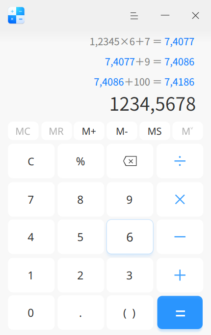
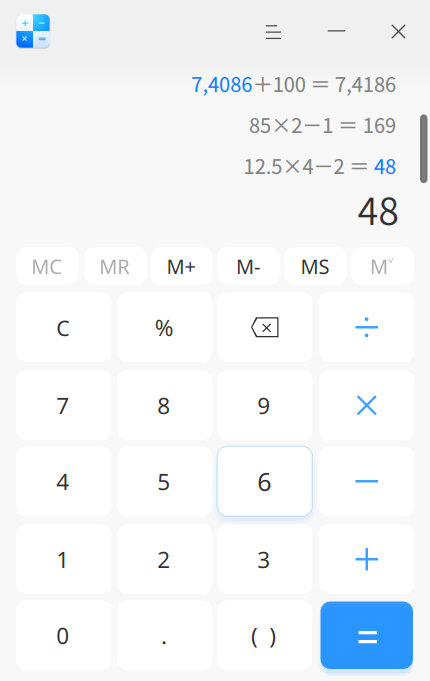
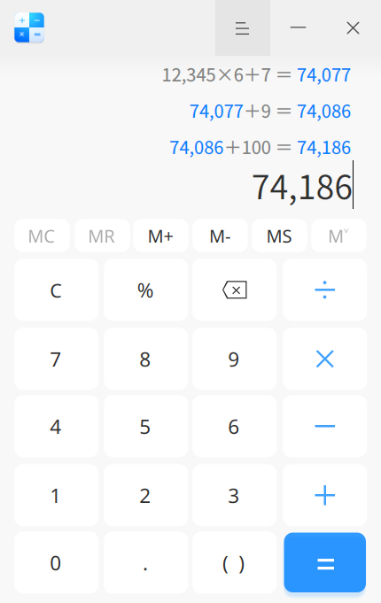
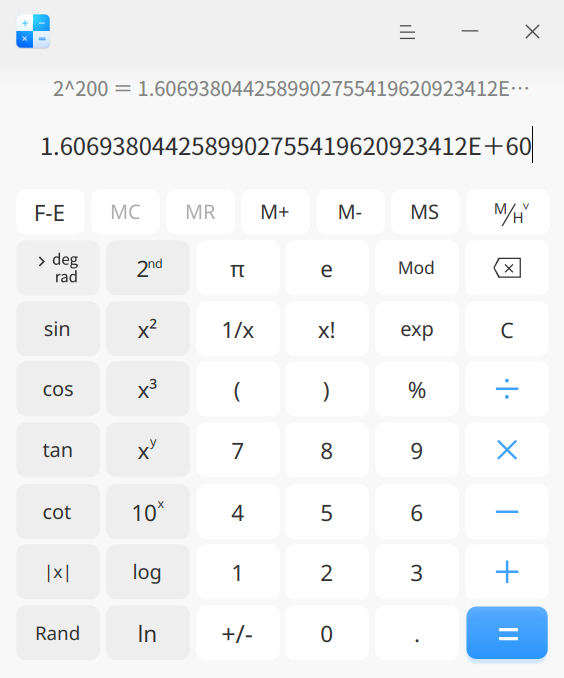
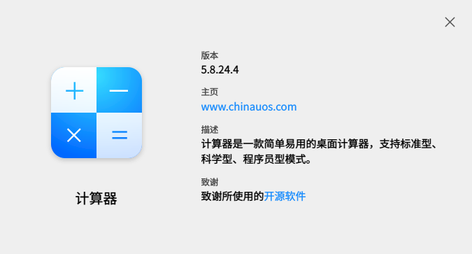

# 计算器|deepin-calculator|

## 概述

计算器是一款功能强大的桌面计算器，支持标准模式、科学模式和程序员模式，完美支持键盘输入，在键盘输入时还支持符号容错及计算结果联动。当前版本为 5.8.24.4，本手册基于该版本的真实界面与已复核行为编写，在系统原有手册结构上做高复用增量校准。

> 说明：文中标注“已验证”的功能均在本轮于计算器 5.8.24.4 中实际执行并观察到结果；仅确认入口存在、未逐项执行的功能会明确标注“未逐项验证”，不作为已验证结论。内存、帮助、退出等功能沿用系统原有手册描述，本轮未逐项闭环。

## 模式介绍

在计算器界面，单击  > **模式**，您可以：

- 选择 **标准**，切换到标准模式界面，执行基本的加减乘除运算。
- 选择 **科学**，切换到科学模式界面，执行函数、指数、方根等高级运算。
- 选择 **程序员**，切换到程序员模式界面，执行二进制、八进制、十进制、十六进制等复杂运算。

模式子菜单包含标准、科学、程序员三项，当前项带勾选标记，三项切换均已实际验证。窗口尺寸随模式自适应：标准模式约 430×681，科学模式约 564×678，程序员模式约 564×718。

### 标准模式

标准模式提供基础四则运算、百分号、括号、内存与历史记录。

| 图标 | 名称 | 说明 |
| --- | --- | --- |
| 0~9 | 数字键 | 基本阿拉伯数字。 |
| MC | 清除键 | 清除所有内存（功能沿用系统原有手册，本轮未逐项执行）。 |
| MR | 存储键 | 重新调用内存（功能沿用系统原有手册，本轮未逐项执行）。 |
| M+ | 存储键 | 内存增加；将当前数值累加到存储器中，中断数字输入（功能沿用系统原有手册，本轮未逐项执行）。 |
| M- | 存储键 | 内存减少；从存储器内容中减去当前显示值，中断数字输入（功能沿用系统原有手册，本轮未逐项执行）。 |
| MS | 存储键 | 内存存储；将输入框中的数值添加到内存列表中（功能沿用系统原有手册，本轮未逐项执行）。 |
|  | 存储键 | 单击  展开内存列表，再次单击折叠内存列表；关闭应用后内存清零。当前内存键标签为 **M^v**，系统原有手册中的 **MH** 标签已不再使用，功能描述沿用原有手册、本轮未逐项执行。 |
| C | 清除 | 清除当前的表达式内容。当前标准模式界面显示单键 **C**。 |
| % | 百分号 | 用来输入百分号。 |
|  | 删除 | 点击一次向前删除 1 个字符。 |
| +-×÷ | 加减乘除 | 基本数学运算符，用来进行加法、减法、乘法、除法运算。 |
| . | 小数点 | 用来输入小数点。 |
| () | 括号 | 用来输入括号，单击一次，同时显示左右括号。如果从键盘输入，输入左括号则出现左括号，输入右括号则出现右括号；若只出现一侧括号，则表达式计算错误。 |
| = | 等于 | 用来得出计算结果。 |

### 科学模式

科学模式在标准运算之外提供三角函数、对数、幂、方根、常量与角度单位切换。

| 图标 | 名称 | 说明 |
| --- | --- | --- |
| F-E | 科学计数 | 单击 **F-E** 开启科学计数，再次单击关闭科学计数。 |
|  | 存储键 | 当前科学模式内存键标签为 **M/H^v**；单击可展示内存列表及历史记录（功能沿用系统原有手册，本轮未逐项执行）。 |
| deg/rad | 角度单位 | 当前科学界面提供 **deg**（角度）与 **rad**（弧度）切换；本轮已验证 deg，rad 未执行。系统原有手册中的 **grad**（梯度）在当前界面不再单列。 |
| sin、cos、tan、cot | 三角函数 | 分别计算数值的正弦、余弦、正切、余切。本轮已验证 deg 下 sin(30) = 0.5。 |
| sin-1、cos-1、tan-1、cot-1 | 反三角函数 | 单击 **2nd** 切换到第二功能界面，分别计算 sin、cos、tan、cot 的反三角函数；入口可见，本轮未逐项取结果。 |
| &#124;x&#124;、Rand | F 函数 | 分别计算数值的绝对值和随机显示一个 31 位的小数。 |
| 2nd | 第二功能键 | 单击 **2nd** 切换到第二功能界面，再次单击返回到三角函数与次方运算界面。 |
| x2、x3、xy | 幂函数 | 分别计算数值的平方、立方、y 次方。 |
| 10x、2x、ex | 指数函数 | 分别计算 10 的 x 次方、2 的 x 次方和 e 的 x 次方；其中 2x 和 ex 为第二功能界面按钮。本轮已验证 2^10 = 1,024。 |
| √x、∛x、y√x | 方根函数 | 单击 **2nd** 切换到第二功能界面，分别计算数值的平方根、立方根、x 的 y 次方根；入口可见，本轮未逐项取结果。 |
| log、ln、logyx | 对数函数 | 分别计算以 10 为底的对数值、以 e 为底的对数值、以 y 为底 x 的对数；其中 logyx 为第二功能界面按钮。 |
| π | 圆周率 | 约等于 3.14159……，可精确到小数点后 31 位。 |
| e | 自然常数 | 约等于 2.71828……，可精确到小数点后 31 位。 |
| Mod | 求余函数 | 显示 x/y 的模数或余数。 |
| 1/x | 反比例函数 | 计算显示数值的倒数。 |
| x! | 阶乘 | 计算显示数字的阶乘。 |
| exp | 指数 | 允许输入用科学计数法表示的数字。 |

> 说明：当前科学界面为 deg/rad。本轮仅在 deg 下验证 sin(30) = 0.5，并验证 2^10 = 1,024；rad 切换、反三角函数、方根函数与对数函数本轮未逐项执行，不能视为已验证。

### 程序员模式

程序员模式左侧固定显示 HEX、DEC、OCT、BIN 四种进制及其同步数值，右侧提供逻辑运算与移位入口。

| 图标 | 名称 | 说明 |
| --- | --- | --- |
| HEX、DEC、OCT、BIN | 进制 | 分别为十六进制、十进制、八进制、二进制；其中十进制为默认进制。本轮已验证四者同步：DEC 255 = HEX FF = OCT 377 = BIN 1111 1111。 |
|  | 全键盘 | 单击返回至全键盘界面。 |
|  | 位切换键盘 | 展示 0～63 位 bit 位，支持点击每一位 bit 位；入口可见，本轮未展开逐位验证。 |
| QWORD/DWORD/WORD/BYTE | 数据类型 | 单击按钮选择模式；分别为四字（64 位）、双字（32 位）、字（16 位）、字节（8 位）。当前默认 QWORD，各类型本轮未逐项切换验证。 |
| /// | 移位切换 | 分别为算术移位、逻辑移位、循环移位、带进位循环移位；入口可见，本轮未逐项执行。 |
| AND、OR、NOT、NAND、NOR、XOR | 逻辑运算符 | 分别为与、或、非、与非、或非、异或；入口可见，本轮未逐项执行。 |
| A~F | 字母 | 仅在 16 进制下被激活。 |
| <<、>> | 移位操作符 | 分别为左移位、右移位；入口可见，本轮未逐项执行。 |

> 说明：进制转换（DEC 255 与 HEX/OCT/BIN 同步）已验证；位运算、位键盘、数据类型切换与移位操作本轮仅确认入口存在，未逐项执行，不能视为已验证。

## 功能介绍

### 千/万分位显示

计算器支持千分位和万分位数字显示，默认按千分位分组（例如 `12,345,678`）。

- 当显示为千分位时，右键单击当前表达式区域，选择 **切换为万分位**，显示随即按万分位分组（例如 `1234,5678`），历史表达式同步变化。
- 当显示为万分位时，右键单击当前表达式区域，选择 **切换为千分位**，可恢复千分位显示。

右键菜单同时包含撤销、恢复、剪切、复制、粘贴、删除、全选等文本编辑项。千分位与万分位切换均已实际验证。

### 符号容错

计算器支持键盘操作，除了支持常规的数字和运算符，还支持数学符号容错功能，让您在键盘输入表达式时，键盘的中英文状态和大小写状态，都不会影响输入表达式。

另外还支持一些特殊的符号容错：

- 乘法符号容错处理：输入 *（星号）或 x（字母 x）都会触发乘法符号激活；本轮已验证 * 显示为 ×。
- 除法符号容错处理：输入 / 字符触发除法符号激活；本轮除号主要使用按钮，键盘 / 未单独验证。
- 加法符号容错处理：输入 +（加号）触发加法符号激活。
- 减法符号容错处理：输入 -（减号）或 _（下划线）都会触发减法符号激活；本轮已验证 _ 显示为 −。
- 百分号符号容错处理：输入 % 字符触发百分号激活。
- 小数点符号容错处理：输入英文小数点 . 正常触发小数点；**当前 5.8.24.4 实测不支持中文句号 `。` 转小数点，输入 `。` 会被直接忽略**。例如输入 `3。25` 实际显示为 `325`，输入 `8。5*2_1` 实际显示为 `85×2−1`，与系统原有手册的描述不符。
- 括号符号容错处理：输入左圆括号或右圆括号都会触发括号符号激活。
- 等于号符号容错处理：输入 **=**（等于号）或按 **Enter** 键都会触发等于号符号激活；本轮已验证 Enter 可得出结果。
- 清除符号容错处理：按 **Esc** 键触发清除符号激活；本轮已验证。
- 删除符号容错处理：按 **Backspace** 键触发删除符号激活；退格按钮本轮可用，键盘 Backspace 未单独验证。
- 字母符号容错处理：无论键盘上处于大写或小写状态，按下 **A~F** 键都会触发字母激活。

### 表达式

+ 在当前输入表达式区域单击 =（等号）、或按下键盘上的 **Enter** 键执行计算，当前输入框中显示计算结果数字，表达式进入历史表达式区域。
+ 历史记录：历史表达式区域按执行顺序展示已计算的表达式及其结果，计算结果默认按千分位显示，可继续参与新的运算。
+ 重新编辑：单击某条历史表达式，可重新编辑表达式，表达式显示在输入表达式区域，重新编辑后按下键盘上的 **Enter** 键或 **=**（等号），修改历史表达式及联动表达式的数字结果。
+ 表达式错误：如输入的表达式错误，则无法计算结果，结果区显示红色“表达式错误”。

本轮已验证：键盘输入 `12345*6+7` 显示为 `12,345×6+7`，按 Enter 得 `74,077`，历史区出现 `12,345×6+7 = 74,077`；误输入多余括号时结果区显示“表达式错误”。

### 科学计数法

在标准模式和科学模式下，计算结果分别大于 16 位和 32 位时用科学计数法显示，即计算结果取前 16 位 / 32 位乘以 10 的正负 n 次方。

+ 当计算结果为整数且大于 16 位 / 32 位时，显示数字 + 小数点后 15 位 / 31 位 + E + 数字。
+ 当计算结果为小数且大于 16 位 / 32 位时，显示数字 + 小数点后 15 位 / 31 位 + E - 数字。

单击 **F-E** 可切换科学计数显示。本轮已验证：科学模式下 `2^200` 在开启 F-E 后显示为 `1.6069380442589902755419620923412E+60`，F-E 按钮呈高亮状态；标准模式超过 16 位时同样会转为科学计数显示（本轮作为记录证据，未纳入正式配图）。

### 数字联动

- 当一个计算表达式显示数字结果后，可以继续输入操作符号，此时，新表达式的第一个数就是上一个表达式的计算结果。

  例如：当前表达式是 10 + 20 = 30，显示计算结果 30 后，键入 + 号，再输入数字 9，会新建一个新的表达式为 30 + 9，按 **Enter** 键，得出新表达式的计算结果为 39。

- 两个表达式产生联动后，修改上一个表达式的数字和操作符，如果其计算结果改变，则会影响与其联动的新表达式的结果。

  例如：两个表达式 10 + 20 = 30 和 30 + 9 = 39 产生联动，如果将第一个表达式的操作符 + 号修改为 × 号，算式为 10 × 20 = 200，则第二个表达式自动转变为 200 + 9 = 209；根据此规则，最多可支持 9 条表达式联动。

- 重新编辑含有联动数字的表达式时，修改联动数字或联动数字的表达式错误时，联动解除，同时会取消数字高亮显示。

本轮已验证：`74,077+9 = 74,086` → `74,086+100 = 74,186`，形成多条联动历史，联动数字以蓝色高亮显示。

> 说明：仅在标准模式下支持数字联动。

## 主菜单

在主菜单中，您可以切换运算模式、切换窗口主题、查看帮助手册，了解计算器的更多信息。主菜单包含模式、主题、帮助、关于、退出五项，均已实际打开确认。

### 主题

窗口主题包含浅色主题、深色主题和跟随系统。本轮仅确认主题子菜单的选项名称与当前选中项（跟随系统），未实际切换主题以验证外观变化，因此不对切换后的视觉效果作已验证结论。

1. 在计算器界面，单击 。
2. 选择 **主题**，选择一个主题颜色。

### 帮助

查看帮助手册，进一步了解和使用计算器。菜单项存在，本轮未点击打开帮助窗口，打开行为沿用系统原有手册描述。

1. 在计算器界面，单击 。
2. 选择 **帮助**。
3. 查看计算器的帮助手册。

### 关于

1. 在计算器界面，单击 。
2. 选择 **关于**。
3. 查看计算器的版本和介绍。

本轮已验证：关于对话框显示版本 **5.8.24.4**、主页 www.chinautos.com、描述与致谢信息。

### 退出

1. 在计算器界面，单击 。
2. 选择 **退出**。

菜单项存在，本轮未执行退出流程，行为沿用系统原有手册描述。
